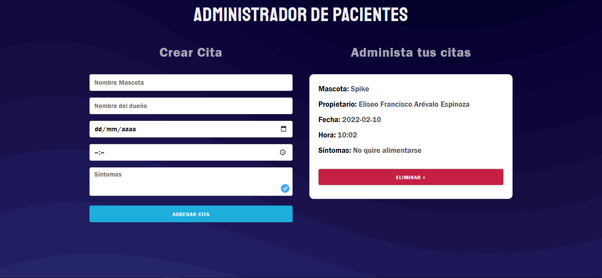

# Administrador de Pacientes(mascotas)

Este proyecto esta realizado en vite usando React.Js biblioteca de Meta
usando también un pequeño framework css **skeleton**

La funcionaidad básica es la de generar cards con cada pasciente usando el hook useState modificando así el estado aplicando también useEffect.

El objeto es guardado con **LocalStorage**

## Tecnologías

- HTML5
- CSS
- Javascript
- React.js v18
- Skeleton
- normalize
- LocalStorage
